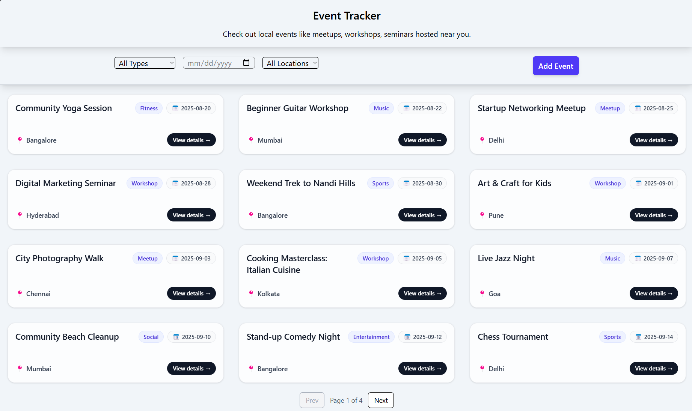

## Starlabs Events – React + Vite App

A modern events listing app built with React, Vite, TypeScript, Tailwind, and Redux Toolkit. It uses `json-server` to mock a REST API for events, locations, and types.

### Screenshot


### Features
- Add new events via a modal form (POST to API)
- Dynamic locations and types endpoints (GET/POST)
- Filter by type, location, and date
- Client-side pagination (12 per page)
- Event details page with RSVP (toast)

---

## Getting Started

### 1) Prerequisites
- Node.js 18+
- npm 9+

### 2) Install dependencies
```bash
cd frontend
npm install
```

### 3) Start the mock API (json-server)
In a separate terminal, run:
```bash
npm run server
```
This serves the following endpoints:
- GET/POST `http://localhost:3001/events`
- GET/POST `http://localhost:3001/locations`
- GET/POST `http://localhost:3001/types`

Notes:
- `locations` and `types` are arrays of objects: `{ id: string | number, name: string }`.
- New locations/types are appended if they don’t already exist (case-insensitive check).

### 4) Configure the frontend API base URL (if needed)
The app reads the API base from `src/config/config.ts` (e.g., `server_url = "http://localhost:3000/"`). Ensure it matches your json-server port.

### 5) Run the frontend
```bash
npm run dev
```
Open the URL printed by Vite (typically `http://localhost:5173`).

---

## Usage Guide

### Create a New Event
1. Click “Add Event”.
2. Fill the form and submit.
3. The event is posted to `/events`. If the provided `location` or `type` doesn’t exist, they are added to `/locations` or `/types` automatically.
4. The grid and filter dropdowns update immediately.

### Filter & Pagination
- Filters are at the top: Type, Date, Location.
- Pagination shows 12 events per page with Prev/Next controls.

### Event Details & RSVP
- Click “View details” on a card to open the event page.
- Click “RSVP” to see a success toast.

---

## API Reference (json-server)

Base URL: `http://localhost:3000/`

- `GET /events` – list events
- `POST /events` – create event
  - Body example:
    ```json
    {
      "id": 23,
      "title": "My Event",
      "type": "Workshop",
      "date": "2025-10-01",
      "location": "Bangalore",
      "host": "Acme",
      "description": "Details..."
    }
    ```
- `GET /locations` – list location options as `{ id, name }`
- `POST /locations` – add a location `{ id, name }`
- `GET /types` – list type options as `{ id, name }`
- `POST /types` – add a type `{ id, name }`

---
> **Note:** Extra data has been added to `db.json` to ensure there are enough events for effective pagination display and testing.
